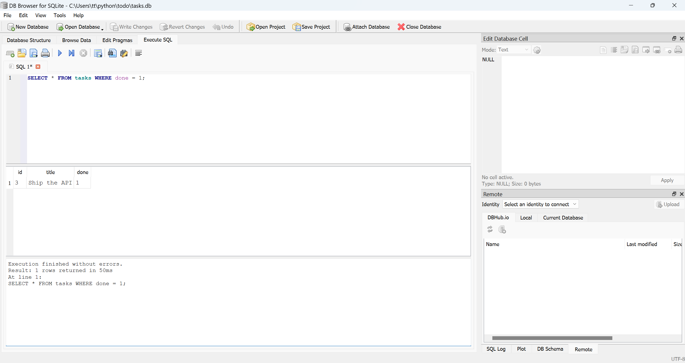

# Task API

A CRUD API for managing a to-do list, built with **Python + FastAPI**, backed by a **SQLite database**.
Built across Assignment A1 (Week 2) and A2 (Week 3, Backend Track) for the FlyRank Internship.

Tasks are stored in `tasks.db`, a single SQLite file created automatically the first time the app runs. Data now survives a server restart — the API's endpoints and responses are identical to A1; only the storage underneath changed.

## Why SQLite

SQLite needs no separate server or install — it's just one file on disk, created the moment the app opens it. That makes it the right fit for a small project like this: zero setup, and data that actually persists between runs, without the overhead of running a full database server.

## How to install & run

Requires Python 3.10+.

```bash
pip install -r requirements.txt
uvicorn main:app --reload --port 8000
```

The server starts at `http://localhost:8000`. `tasks.db` is created automatically on first run, with its table and 3 seed tasks. Interactive Swagger docs are available for free at `http://localhost:8000/docs`.

To start completely fresh, delete `tasks.db` and restart the server — it will recreate the table and reseed automatically.

## Endpoints

| Method | Path            | Description                          | Success | Errors |
|--------|-----------------|---------------------------------------|---------|--------|
| GET    | `/`             | API info                              | 200     | —      |
| GET    | `/health`       | Health check                          | 200     | —      |
| GET    | `/tasks`        | List all tasks (supports `?done=`, `?search=`, `?limit=&offset=`) | 200 | — |
| GET    | `/tasks/{id}`   | Get a single task                     | 200     | 404 if not found |
| POST   | `/tasks`        | Create a task (`{"title": "..."}`)    | 201     | 400 if `title` missing/empty |
| PUT    | `/tasks/{id}`   | Update a task's `title` and/or `done` | 200     | 400 if body empty/invalid, 404 if not found |
| DELETE | `/tasks/{id}`   | Delete a task                         | 204     | 404 if not found |
| GET    | `/stats`        | Task counts (`total`, `done`, `open`) | 200     | — |
| POST   | `/reset`        | Wipe and reseed the 3 example tasks   | 200     | — |

All queries use parameterized placeholders (`?`) — no request data is ever glued directly into a SQL string.

## Example request

```bash
curl -i -X POST http://localhost:8000/tasks -H "Content-Type: application/json" -d '{"title":"Buy milk"}'
```

```
HTTP/1.1 201 Created
content-type: application/json

{"id":4,"title":"Buy milk","done":false}
```

## Persistence, proven

Created a task, deleted another, then restarted the server twice. Both changes held, and the 3-task seed did not re-run or duplicate — the count stayed correct across restarts. That's the whole point of moving to a database: the app's memory can disappear, but the file on disk doesn't.

## Exploring the database directly

Opened `tasks.db` in [DB Browser for SQLite](https://sqlitebrowser.org/) and ran a query by hand in the "Execute SQL" tab:

```sql
SELECT * FROM tasks WHERE done = 1;
```

<!-- Paste what it returned here, e.g.: "Returned 2 rows — the tasks I'd marked done." -->

Calling `GET /tasks` from the API right after showed the exact same data — DB Browser and the API are reading the same file, with no syncing step in between.



<!-- Take a screenshot of tasks.db open in DB Browser (the Browse Data or Execute SQL tab),
     save it as db-browser-screenshot.png in this repo, and commit it. -->

## Swagger UI

`/docs` lists every endpoint and lets you run the full CRUD cycle with "Try it out."


## What changed since A1

The API surface is identical — same endpoints, same request/response shapes, same status codes. Only the storage layer changed: an in-memory Python list became a SQLite database file. That's the whole exercise — the API is the promise, the database is where the promise gets kept.
